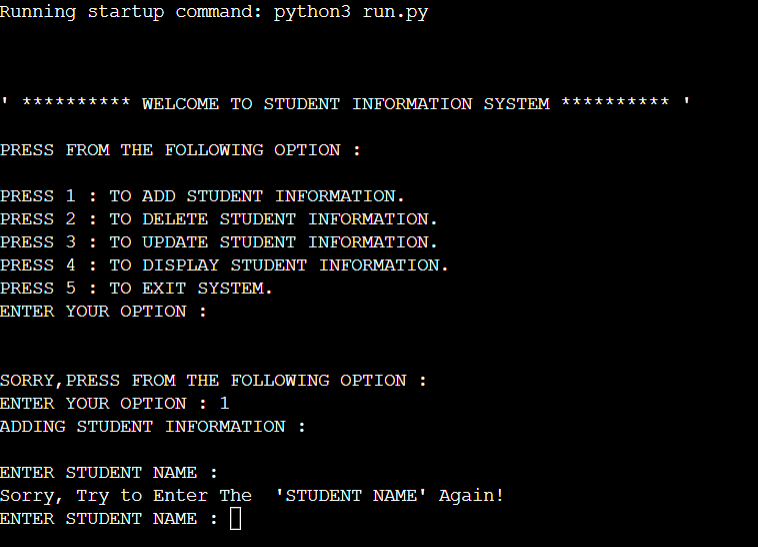

# Student Information

This is a command-line tool that allows a user to access their Student Information System and add/delete, update, and display information. The Code Institute's simulated terminal is used to run this project, which was created for educational goals.

[Live application here.](https://student--information.herokuapp.com/)
---

# User Experinece (UX)

- To start preparing this project, I began with UX, developing the program's logic based on the user stories. Since this is a command-line program, no design is included because HTML and CSS were not used.

## Strategy
User Stories:

 - As a user, I want to be able to easily access all of my student information at once.
 - As a user, I want to be able to add student information.
 - As a user, I want to be able to delete student information.
 - As a user, I want to update student information if there has been a change.
- As a user, I want to be able to display student information.
- As a user, I want to be able to exit the system.

# Features

The following are the features that are included in this application, as mentioned in the main menu:

---

## Add Student Information:

- From the main menu the first option is to Add Student Information.
- Press 1 to choose this option.
- If the user does not enter a value, it will return the choosen option again. This applies to all of the empty inputs.

- Once the user has selected this option, they are then asked to input a value for Student Name, Roll Number, Age, Class, Email, Address and Mobile Number.
- Once all fields have been entered the Student is saved.

 
---

## Delete Student Information:

- From the main menu the second option is to Delete Student Information.
- Press 2 to choose this option.
- Once the user has selected this option, they are then asked to input a value for Roll Number.

---

## Update Student Information:

- From the main menu the third option is to Update Student Information.
- Press 3 to choose this option.
- Once the user has selected this option, they are then asked which attribute do they want to update for example, Name, Roll Number, Age, Mobile Number, Address, Email or Class.
- When the user has choosen an attribute they will then be asked to input the 'old' value and then enter the 'new' value. 

--- 

## Display Student Information:

- From the main menu the fourth option is to Display Student Information.
- Press 4 to choose this option.
- Once the user has selected this option, all student information will be displayed. 

--- 

## Exit System
- From the main menu the fifth option is to Exit Student Information.
- Press 5 to choose this option.
- Once the user has selected this option, they will automatically Exit the system.

---

# Technologies Used

I have used several technologies that have enabled this design to work:

- [Python](https://www.python.org/)
    - Python is the primary programming language used to create all of the code that makes this application work.
    - As well as, core Python I have used the following Python modules:
        - [Gspread](https://docs.gspread.org/en/latest/)
            - Used to view and update data in my Google Sheets document throughout the app.
        - [Google Auth](https://google-auth.readthedocs.io/en/master/)
            - This was used to provide access to the program so as to connect with my Google Sheet.
- [GitHub](https://github.com/)
    - Used to store code for the project after being pushed.
- [Git](https://git-scm.com/)
    - The Gitpod terminal was used to commit to Git and push to GitHub for version control.
- [Gitpod](https://www.gitpod.io/)
    - Used as the development environment.
- [Heroku](https://dashboard.heroku.com/apps)
    - Used to deploy my application.
- [Grammarly](https://www.grammarly.com/)
    - Used to fix the thousands of grammar errors across the project.
- [Google Sheets](https://www.google.co.uk/sheets/about/)
    - Used to store the 'Contacts' data used for the application.
- [Pep8](http://pep8online.com/)
    - Used to test my code for any issues or errors.

# Testing
I manually tested this project by doing the following procedures:
- Passed the code through a PEP8 linter and confirmed there are no problems.
- Testing in the Code Institute Heroku terminal.

# Bugs

## Solved bugs
- When I wrote "import gspread" I forget to give the command on the terminal "pip3 install gspread google-auth".

## Remaining bugs
- Bugs remain where 'Problems' can be found in the run.py

## Validator Testing
- PEP8 
    - No errors were returned.

# Deployment

- The deployed version of this application was built using the master branch of this repository.

## Using Github & Gitpod

- To deploy my command-line interface application, I had to use the [Code Institute Python Essentials Template](https://github.com/Code-Institute-Org/python-essentials-template), as this enables the application to be properly viewed on Heroku using a mock terminal. 

    - Click the `Use This Template` button.
    - Add a repository name and brief description.
    - Click the `Create Repository from Template` to create your repository.
    - To create a Gitpod workspace you then need to click `Gitpod`, this can take a few minutes.
    - When you want to work on the project it is best to open the workspace from Gitpod (rather than Github) as this will open your previous workspace rather than creating a new one. You should pin the workspace so that it isn't deleted.
    -  Committing your work should be done often and should have clear/explanatory messages, use the following commands to make your commits:
        - `git add .`: adds all modified files to a staging area
        - `git commit -m "A message explaining your commit"`: commits all changes to a local repository.
        - `git push`: pushes all your committed changes to your Github repository.

### Forking:

- You can contribute to this project without affecting the main branch with the following steps:
1. Navigate to github repositores select this [repository](https://docs.github.com/en/get-started/quickstart/fork-a-repo)
2. On the right of the repository name you will find the fork button next to star and watch buttons.
3. Pressing said button will create a copy for you to use.

### Cloning:
- You can clone this repository to local device with the following steps:
1. Navigate to github repositores select this [repository](https://github.com/Ion71229/Milestone-3)
2. Under the repository name there is a green clone or download button.

### Steps to deploy on Heroku:

- The site is deployed on [heroku](https://www.heroku.com/)
- The steps I took to deploy on heroku are as follows:

    - Go to www.heroku.com and login or create an account. 
    - On the dashboard in the top right click on "new app".
    - Click settings. 
    - Under config vars add key: PORT and Value 8000.
    - Under buildpacks add python and node.js in that order. 
    - Go to deploy.
    - Link Heroku app to your github and search for the repository.
    - Click on deploy to build the app.

# Credits

- All of this code has been written by me, I have used [Stack Overflow](https://stackoverflow.com/) , `Gspread` and `Slack` to  help my code and fix any issues that I had.

[Zfill method help](https://www.w3schools.com/python/ref_string_zfill.asp)

# Acknowledgements
- I would like to thank my mentor Adegbenga Adeye and the slack community for their great advice, tips and the code review.